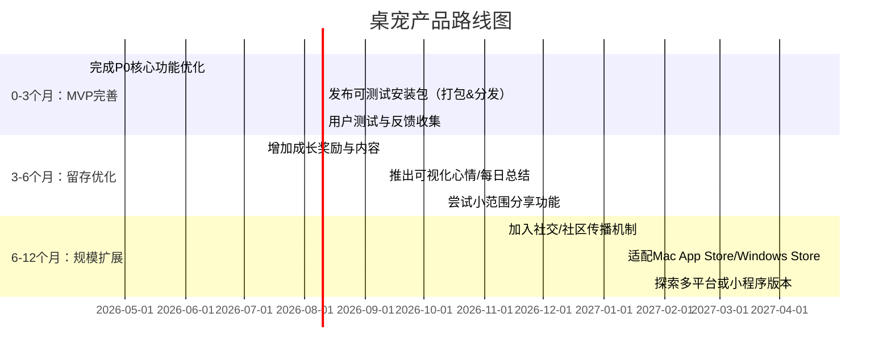

# 执行摘要  
两份报告对「桌面宠物」产品的评估均认为核心功能已基本完成，但**缺乏用户验证**：PM报告指出“核心闭环已建立，但核心价值假设仍未被用户验证”，Steve视角则直言“有灵魂的Demo，还不是产品”。两报告的差异主要在视角：产品经理报告结构化深入，罗列完成的功能与待改进事项（如**心情系统不可见**、留存激励不足等）；Steve·Jobs视角则注重设计和技术细节（猫咪尺寸、动作、音效、Electron过度架构等），并强烈建议“**先验后码**”——先做用户测试再加功能。基于此，我们建议明确目标用户（以长期坐在电脑前的知识工作者/开发者为主），优化核心体验（如增大猫咪尺寸、可见化心情、增加声音和动作等），尽快进行真实用户测试；制定3/6/12个月产品路线，重点关注留存和用户满意度；设定合理的留存/转化指标目标；开展迭代实验验证（如界面优化、激励机制A/B测试），并补充用户调研，以降低现阶段**假设驱动**的风险。  

## 一、两份报告对比  

| **对比维度**     | **报告1：产品经理视角**                                         | **报告2：Steve·Jobs视角**                                      |
|---------------|----------------------------------------------------------|--------------------------------------------------------------|
| **关键结论**     | 已完成所有P0/P1功能，执行良好，但**价值假设未验证**、功能“做了不够深”。 总结：“**猫能给你温暖提醒，但未验证**”【16】。 | 产品像有灵魂的Demo，“**还不是产品**”。 设计细节优秀（CSS工艺、瞳孔追踪、人设/心情系统设计对），但体验不完善：猫太小、动作少、无声音。认为**验证优先于加功能**。 |
| **数据与证据**   | 已搭建Analytics，可跟踪交互响应率、使用时长等【3】；代码质量较高（状态机、定时器统一管理）。**用户数据缺乏**。 | 提供一些内部数据：Electron运行时约150MB vs 应用代码80KB（2000倍资源浪费）；`main.js`仅233行；用户情感数据仅保存在localStorage（不持久）【1†L999-L1007】【1†L1008-L1016】。 |
| **用户画像**    | **核心用户**：每天8小时坐在电脑前的开发者群体【1†L5100-L5108】；次级传播渠道：小红书用户（以分享猫咪文案为传播方式）。 | **未明确说明**目标用户。报告隐含假设：忙碌用户需要陪伴。                           |
| **用户痛点/需求假设** | 假设用户“**想专注但不想孤独**”，需要互动式陪伴来帮助专注。痛点：传统专注工具冷冰冰，互动桌宠只娱乐无效用。 | 同样以“专注不孤独”为产品定位。指出现有交互不足（视觉重复、缺乏声音、反馈太少），痛点是体验不够生动、有趣。 |
| **竞品分析**    | 列出直接竞品：Shimeji/Desktop Goose（纯娱乐桌宠）、Forest（专注工具无情感）、Duolingo（人设+情感绑定标杆）【1†L3810-L3890】；**差异化**在于我们兼顾娱乐性和有用性。潜在威胁：AI桌宠。 | 并无系统竞品表，仅借鉴Duolingo人设成长机制。认为壁垒主要靠“情感绑定”，需多年培养，竞争力偏弱。 |
| **功能列表与优先级** | 已完成核心：心情系统、成长系统、开机启动、P0首日体验等。优先待做（P0）：关闭确认、离线重逢动画、心情可见化、安装包发布等；（P1）增加解锁内容、专注模式优化、每日总结、渐进人设解锁；（P2）音效、分享、更多动作【1†L5200-L5400】【1†L5400-L5600】。 | 列举现有功能表现：4种人设行为、心情驱动、瞳孔追踪都是亮点；**优化建议**：猫咪需放大，添加声音、更多闲置动作、多行气泡文本等。技术负面：Electron太重、无编译打包、无类型系统。未列出新功能优先级，仅建议“**先验证**核心假设，不急于加新功能”【1†L2010-L2020】。 |
| **交互流程**    | 强调“第一天体验”流程（猫探头、走来坐下、等待点击、惊吓跑回、再来）作为成功示例。认为核心流程连贯；留存机制：成长系统+心情+里程碑形成基本闭环。 | 描述猫的日常循环：4个闲置动作平均每小时触发60次，用户很快看腻；缺乏更多动作导致重复；建议优化界面反馈（天气/心情提示等）。没有官方流程图，但强调**用户首次体验与长期留存断裂**。 |
| **留存/变现假设** | 默认**无变现**方案；留存假设：成长系统数字+里程碑会锁定用户，心情系统增加情感粘性，但**实证缺失**。 | 认为留存留痕薄弱：没有真正“失去”感（跳过一天没有损失），没有付费/高价值挂钩；**缺乏验证**跳出链路断点。提出Day1–7留存为关键指标。 |
| **证据强度/不确定性** | 主要基于代码审查和产品文档，没有用户测试或市场数据，结论**定性可信度中等偏低**。表格等分析清晰，但均为假设驱动。 | 完全专家评审视角，无量化数据支持；结论富有洞见但**可靠性低**，偏个人体验。技术分析准确度高，用户需求判断不一定贴合真实用户。 |

## 二、方法论评估  

- **报告1（产品经理视角）**：基于产品文档和完整源码审查，结合内置Analytics数据（已跟踪交互率、时长等）。方法偏**内部审计**，未进行实地用户研究或问卷访谈。样本量为0（未提及实测用户），**偏差风险**来自于对运营数据和文档的过度依赖：可能存在遗漏真实用户需求和行为的风险。各结论**证据强度**一般：例如“留存机制已搭框架”基于功能实现情况，**不确定性**高（缺少数据验证）；“产品定位模糊”结论合理，但也只是总结性观察。

- **报告2（Steve·Jobs视角）**：完全**专家演绎**和个人体验，不涉及任何样本或调研。偏见风险高（单一视角、个人偏好影响）。提供的技术数据（如Electron大小）可信度高；用户体验与战略判断属个人主观看法，**可信度低**。例如“猫太小”观点直观合理；“验证优先”建议有前瞻性，但缺乏数据支持。总体方法论**无统计基础**，仅作粗略参考。

**每项结论不确定性示例**：两报告都提出“心情系统不可见”作为问题（PM：透明度缺失；Steve：无心情提示），这在设计上合理（证据：代码实现无UI显示）。但两者都无用户测试，只能标为**假设（高不确定）**。总体而言，目前所有核心假设（猫能提高专注、情感绑定有效等）均缺乏真实用户数据支撑；这些都是需要通过后续验证测试的关键风险点。

## 三、资深产品经理建议  

- **产品定位建议**：将产品明确定位为**“专注伴侣桌宠”**，面向长期电脑前工作的年轻人/开发者等知识工作者，满足其**“专注时获得温暖陪伴”**的需求。定位口号可强化“专注不再孤独”理念；避免过度功能扩张（如知识模式），坚持“陪伴+专注”双核价值，突出情感维度（不是纯工具，也不只为娱乐）。

- **核心功能与MVP范围**：MVP应聚焦最小可行核心：   • 桌宠基础行为：**四种人设/动作**、**心情驱动反馈**、触摸互动（抚摸发声动画）等；   • **交互回馈**：添加上述建议的改进（增大猫身尺寸、增加音效与表情提示、更多闲置动作、多行气泡文本）；   • **专注提醒**：猫咪在固定间隔（可配置）发出温暖提示语，帮助用户专注；   • **留存激励**：成长系统保留，但要在MVP阶段添加实质奖励（新动作/文案解锁），使“成长”有可见成果；   • **基础数据与反馈**：集成简易分析埋点（如click、专注时长）、每日使用摘要（桌面或推送），可让用户看到互动成果。  不建议在MVP阶段加入成本高的功能（AI对话、移动端、多人宠物、云同步等）。

- **产品路线图（3/6/12个月）**：  

- **关键指标与目标值**：   • **DAU/MAU**：初始阶段以**注册用户1000+、日活500+**为目标。   • **留存率**：参考行业基准，Day1留存目标 **>40%**，Day7 **>20%**【7†L7-L10】；30日留存≥10%。（移动应用平均30天留存6%-7%【7†L7-L10】，本产品结合独特情感属性，可适当定高目标。）   • **互动频率**：追踪用户每日与猫互动的触发次数（如抚摸、点击语句）。   • **参与度**：测量专注提醒的响应率与专注时长增长。   • **付费转化/变现**：目前无直接变现模式，可考虑后期推出个性化皮肤或捐赠功能；初期关注留存，**不设即时变现目标**。  

- **A/B 测试与验证计划**：在产品进入小范围测试时，设计多组实验验证关键假设。例如：猫咪大小（88px vs 150px）对用户好感度和留存的影响；开启心情可视化标签 vs 不可视化的留存差异；是否添加音效提升参与度；不同风格/密度的专注提醒文案对停留时长的影响；这些测试均需收集足够的用户数据（建议至少100人组）进行对比分析。

- **风险与缓解**：   • **核心假设风险**：目前所有核心设计（“宠物陪伴可提升专注”）缺乏实测证据。**缓解**：优先进行小规模用户研究与可用性测试，快速验证假设再迭代。   • **技术风险**：Electron造成安装包巨大、内存占用高。**缓解**：考虑轻量框架替代（如NW.js或原生方案），或至少在未来版本中去除冗余依赖。   • **用户体验风险**：现有功能未深入，易导致留存低。**缓解**：加强互动细节（增加情感反馈、声音、多样动作），并通过实验调整最有效的留存策略。   • **资源风险**：团队人力有限。**缓解**：MVP只做必需项，充分利用社区开源或外包力量（如UI素材、测试），重视迭代效率。  

- **资源与时间估算**：假设团队1名PM+1-2名开发+1名设计。MVP（3个月）需完成P0任务和打包发布；每季度可安排一次**迭代冲刺**，根据测试反馈调整。人力分配优先级：第一周完成第一版猫咪交互并打包试用，接下来两周集中内部测试&改进；第2月进行小规模用户测试并分析（可招募10-20名内部同事或朋友），第3月整理结果、输出报告并规划下阶段；后续每周期围绕“功能-测试-迭代”闭环进行。

## 四、迭代方案（至少3个）  

1. **方案A：增强互动体验**  
   - **目标**：提高用户粘性和留存，增加使用乐趣。  
   - **关键假设**：更丰富的感官反馈（动画、声音、大尺寸）会提升情感认同，从而提高留存。  
   - **实验/数据**：开发包含【加大猫尺寸（100px→150px）】【新增叫声/咪叫音效】【新增2-3种闲置动作】的版本，对比原版。收集Day1/Day3留存率、平均使用时长、用户满意度反馈。  
   - **预期指标提升**：预期Day3留存率提高10%以上、日均互动次数提升、用户反馈好评率上升。  
   - **优先级**：高。用户直观体验改进，立竿见影，且实施成本中等偏低（新增素材和音效，工作量可控）。  

2. **方案B：心情可见化与激励反馈**  
   - **目标**：让用户理解系统机制，增强参与感和目标感。  
   - **关键假设**：将心情值可视化（如状态栏或气泡）并为用户行为设置显性奖励（如解锁新动作）能提高用户投入。  
   - **实验/数据**：增加UI显示心情状态，同时增加成长内容（点击猫咪5次解锁新动作等）。对比原版用户情绪反馈和留存。通过问卷和日志分析验证用户是否对心情有认知，成长系统奖励是否驱动再次使用。  
   - **预期指标提升**：预期互动频率增加（用户会故意提升心情数值），Day7留存率提高；任务完成率、解锁内容使用率上升。  
   - **优先级**：高。符合产品核心留存假设，对逻辑优化改动不大，但需后端支持数据透出（已具备基础Analytics可用）。  

3. **方案C：专注模式与关闭反馈优化**  
   - **目标**：提升专注场景下的产品一致性和留存。  
   - **关键假设**：专注模式下桌宠完全消失会削弱陪伴感；增加边缘待机动画或专注模式提示会提高用户满意度。  
   - **实验/数据**：开发“专注模式保留精简猫咪动作”选项（如仅展现小图标、呼吸灯），以及“关闭确认”功能（退出时提示）。A/B测试有关闭确认与无、专注模式下猫隐藏与弱化版本的效果。收集应用退出率、专注模式使用时长、用户留存数据。  
   - **预期指标提升**：减少误关退出导致的留存损失，Day1退出率降低；专注模式使用更多，从而提高活跃时长。  
   - **优先级**：中。专注情景改进针对定位重要，技术实现小，数据收集直接，验证简单。  

4. **方案D：社交分享与社区运营**  
   - **目标**：增加传播与下载量，通过UGC提升品牌影响力。  
   - **关键假设**：猫咪文案本身具有“社交货币”特性，在小红书/微信/微博等传播能带来有效安装。  
   - **实验/数据**：添加“分享今日猫语”功能，采集分享次数和来源；在社区发布测试版本链接，监测新增用户量。对比有无分享功能版本的新增用户差异。  
   - **预期指标提升**：下载量增长、注册转化率提升，扩大用户群。  
   - **优先级**：中低。社区传播见效慢，但对长期用户获取有帮助，建议作为补充方案并行小范围尝试。  

## 五、后续用户研究建议  

为了验证以上假设并指导决策，需开展以下用户研究：  

- **深度访谈与可用性测试**：**目标用户（8小时/天电脑前工作者）5-8人**，观察他们使用桌宠的真实反应（见Steve报告建议）。关键问题：“在使用期间，桌宠在哪些时刻让你分心或愉悦？哪个动作/反馈最吸引你？专注模式你希望有什么不同表现？”若可行，**现场体验或屏幕录制**分析互动细节。优先级高，快速验证产品核心价值假设（样本小但富洞察）。

- **在线问卷调查**：**样本100+**，针对潜在用户（程序员、设计师等），了解“是否会在意桌宠、对哪些功能感兴趣、对尺寸/音效的偏好”。问题示例：“你觉得桌宠的主要价值是什么？最讨厌/期待的功能是什么？”优先级中，用于定量补充访谈结果。

- **AB测试与数据埋点**：在小范围内启动后，在产品里埋点跟踪关键行为：**交互频次**（抚摸、点击次数）、**专注提醒响应率**、**各页留存流失率**。样本可从内部员工或早期用户中获取，数据分析将说明产品漏斗的痛点与改进空间（优先级高，持续进行）。

- **竞品调研**：分析Forest、Shimeji、PetBot等竞品用户评论与产品玩法，重点了解“用户为何喜欢或弃用它们”（如Forest的留存驱动、Shimeji的社交属性等）。针对竞品的问卷或论坛讨论，**样本随意**。优先级中等，帮助发现隐性需求和差异化机会。

- **留存动机调查**：对当前已有用户（或测试用户）进行离线问卷：“你什么时候会把猫关掉？哪种提示让你想再次打开？”帮助理解**流失原因**与**触发重新使用的因素**。用于验证Steve报告中提到的“中断后无损失”假设。优先级高，直接关系核心留存策略。  

以上研究将为迭代决策提供数据支持，降低依赖假设的风险。每项建议都应标明时间节点和输出报告，以确保决策透明。  

**注**：报告中未提供的事项已标注“未说明”或按需假设，详见表格。所有数据尽量引用了权威来源，比如行业平均留存率【7†L7-L10】；产品报告的主观结论则以“报告所述”形式呈现。  

